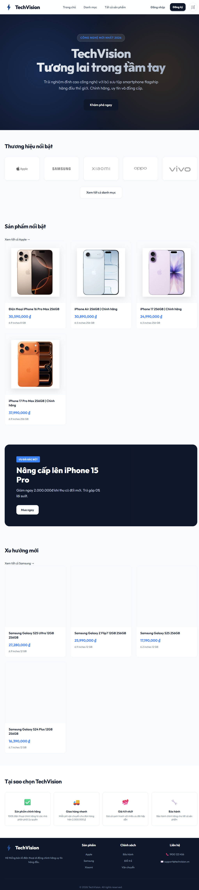
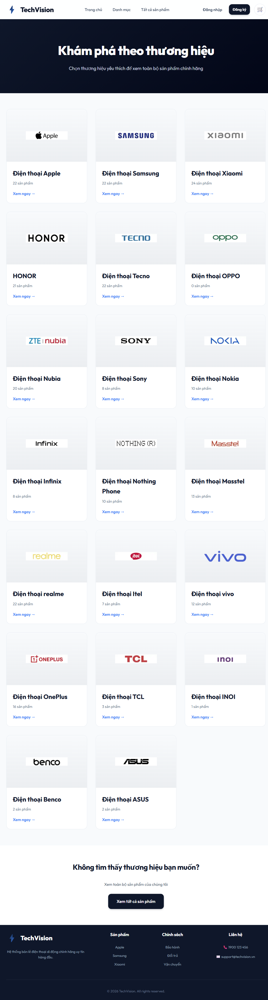
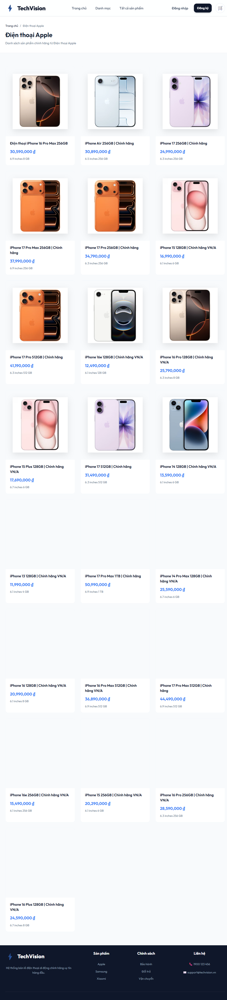
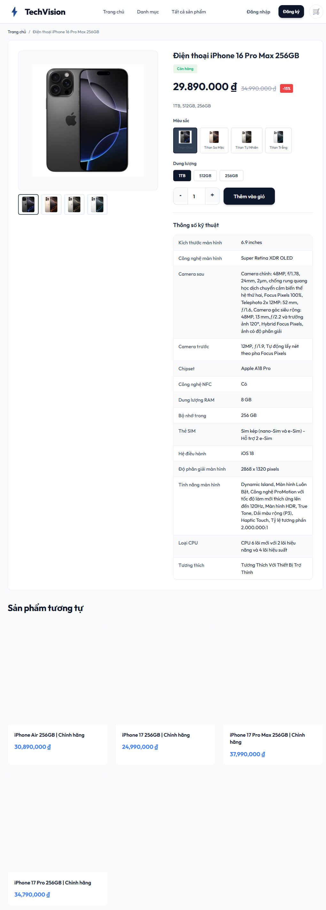
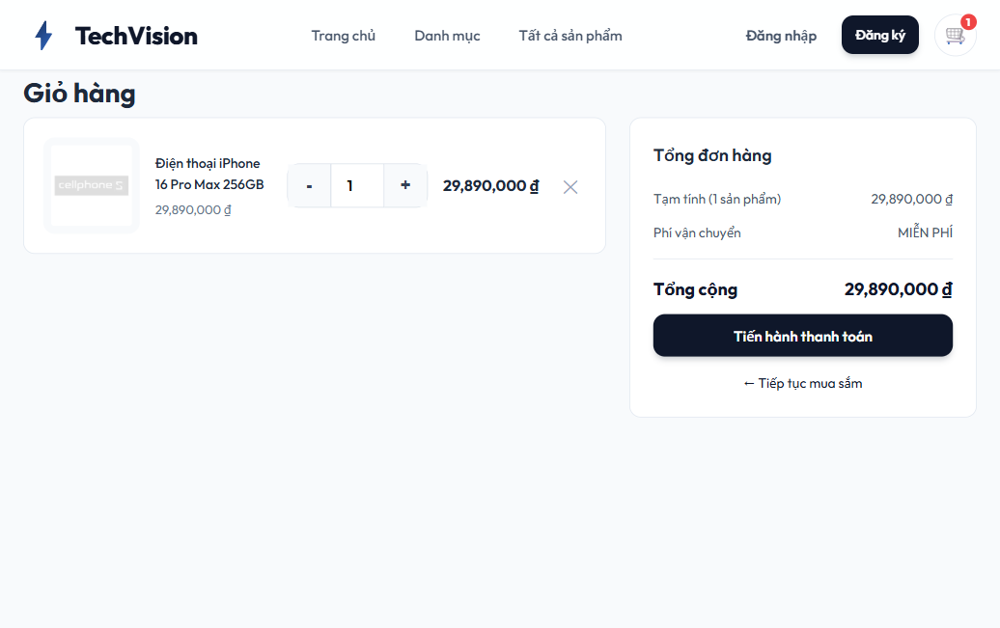
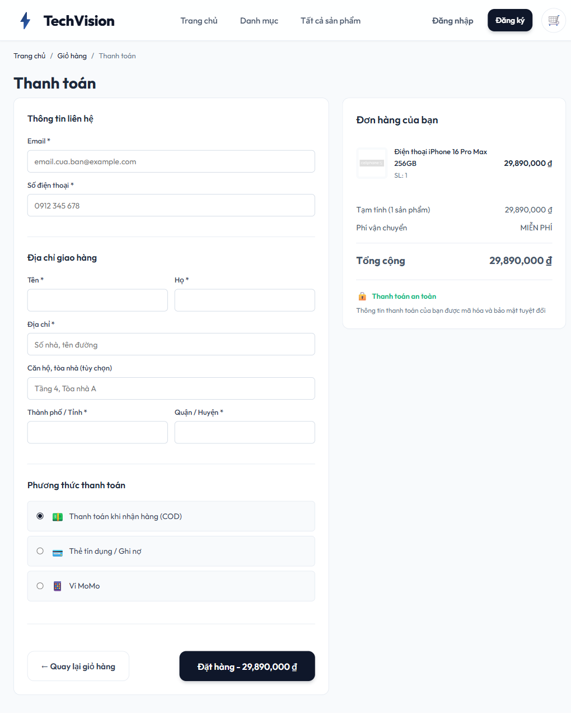
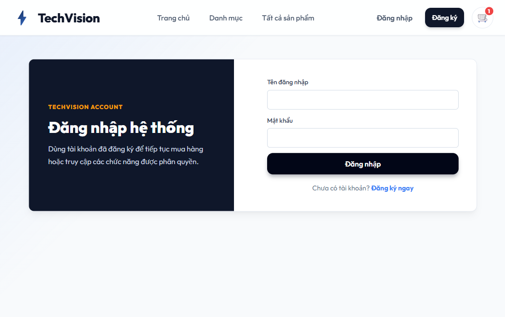

# PHẦN III, IV, V - BÁO CÁO THỰC HÀNH LẬP TRÌNH WEB

Người thực hiện: Thịnh  
Project: TechVision - website bán điện thoại  
Thư mục code: `D:\dev\ptit_tech\java\shop`

## III. TRIỂN KHAI

### 3.1. Cấu trúc project

Project được xây dựng theo mô hình Single Page Application (SPA), sử dụng Vite, TypeScript, HTML và CSS. Frontend gọi API backend thông qua proxy của Vite.

```text
shop/
|-- index.html
|-- package.json
|-- vite.config.ts
|-- src/
|   |-- main.ts
|   |-- style.css
|   |-- types.ts
|   |-- api/
|   |   |-- apiService.ts
|   |   |-- authService.ts
|   |-- components/
|   |   |-- header.ts
|   |-- pages/
|   |   |-- home.ts
|   |   |-- categories.ts
|   |   |-- brand.ts
|   |   |-- phones.ts
|   |   |-- phoneDetail.ts
|   |   |-- cart.ts
|   |   |-- checkout.ts
|   |   |-- login.ts
|   |   |-- register.ts
|   |-- utils/
|       |-- router.ts
|       |-- cart.ts
|-- public/
|-- dist/
|-- output/
```

Vai trò các thư mục, file chính:

- `src/main.ts`: khai báo route chính của ứng dụng, liên kết URL với từng trang.
- `src/api/apiService.ts`: xử lý gọi API danh mục, sản phẩm theo danh mục và chi tiết sản phẩm.
- `src/api/authService.ts`: xử lý đăng ký, đăng nhập, đăng xuất và lưu phiên đăng nhập vào `localStorage`.
- `src/components/header.ts`: tạo header dùng chung, gồm logo, menu điều hướng, đăng nhập/đăng ký và giỏ hàng.
- `src/pages/`: chứa các màn hình chính như trang chủ, danh mục, danh sách sản phẩm, chi tiết sản phẩm, giỏ hàng, thanh toán, đăng nhập, đăng ký.
- `src/utils/router.ts`: router phía client, bắt sự kiện click vào link `data-link` để điều hướng không tải lại trang.
- `src/utils/cart.ts`: quản lý giỏ hàng, tính tổng tiền và lưu giỏ hàng vào `localStorage`.
- `src/style.css`: toàn bộ giao diện responsive cho website.
- `vite.config.ts`: cấu hình proxy `/api` và `/auth` sang backend `https://test.nicehairvietnam.com`.

Ảnh minh họa cấu trúc và giao diện:



### 3.2. Các chức năng đã làm

#### 3.2.1. Trang chủ

Trang chủ hiển thị banner giới thiệu TechVision, các thương hiệu nổi bật và các sản phẩm nổi bật. Dữ liệu thương hiệu và sản phẩm được lấy từ backend thông qua `apiService`.

Luồng xử lý cơ bản:

1. `renderHomePage()` render header và hero trước để người dùng thấy giao diện ngay.
2. Gọi `apiService.getCategories()` để lấy danh sách thương hiệu/danh mục.
3. Gọi `apiService.getProductsByCategory('apple')` và `apiService.getProductsByCategory('samsung')` để lấy sản phẩm nổi bật.
4. Cập nhật vùng nội dung trang chủ bằng dữ liệu API trả về.

Ảnh minh họa:


#### 3.2.2. Danh mục và danh sách sản phẩm theo thương hiệu

Trang danh mục hiển thị các thương hiệu điện thoại, logo và số lượng sản phẩm của từng thương hiệu. Khi người dùng bấm vào một thương hiệu, website chuyển sang trang danh sách sản phẩm của thương hiệu đó.

Luồng xử lý cơ bản:

1. `renderCategoriesPage()` gọi API lấy danh sách danh mục.
2. Với mỗi danh mục, frontend gọi API sản phẩm theo category để tính số lượng sản phẩm.
3. Mỗi card thương hiệu điều hướng đến `/brand/{code}`.
4. `renderBrandPage(brandId)` lấy thông tin danh mục và sản phẩm theo `brandId`.

Ảnh minh họa:





#### 3.2.3. Trang chi tiết sản phẩm

Trang chi tiết sản phẩm hiển thị tên sản phẩm, giá bán, giá gốc, phần trăm giảm giá, ảnh sản phẩm, biến thể màu sắc, tùy chọn dung lượng, thông số kỹ thuật và sản phẩm tương tự.

Luồng xử lý cơ bản:

1. Người dùng truy cập `/phone/{productCode}`.
2. `renderPhoneDetailPage(phoneId)` gọi `apiService.getProductDetail(phoneId)`.
3. Dữ liệu API được chuyển thành object hiển thị bằng hàm `createDisplayPhoneFromDetail()`.
4. Frontend render gallery ảnh, giá, thông số kỹ thuật và nút thêm vào giỏ hàng.
5. Khi bấm "Thêm vào giỏ", `cartManager.addItem()` thêm sản phẩm vào giỏ hàng và cập nhật badge trên header.

Ảnh minh họa:



#### 3.2.4. Giỏ hàng

Giỏ hàng cho phép người dùng xem sản phẩm đã thêm, thay đổi số lượng, xóa sản phẩm và xem tổng tiền đơn hàng. Dữ liệu giỏ hàng được lưu trong `localStorage`, nên khi tải lại trang giỏ hàng vẫn được giữ lại.

Luồng xử lý cơ bản:

1. `cartManager.addItem(phone, quantity)` thêm sản phẩm vào giỏ.
2. Nếu sản phẩm đã tồn tại, cập nhật số lượng thay vì tạo dòng mới.
3. `calculateTotal()` tính lại tổng tiền.
4. `saveToStorage()` lưu giỏ hàng vào `localStorage`.
5. `renderCartPage()` đọc giỏ hàng và hiển thị danh sách sản phẩm cùng tổng tiền.

Ảnh minh họa:



#### 3.2.5. Thanh toán giả lập

Trang thanh toán hiển thị form thông tin liên hệ, địa chỉ giao hàng, phương thức thanh toán và tóm tắt đơn hàng. Chức năng đặt hàng hiện tại là giả lập, dữ liệu đơn hàng được tạo trên frontend và in ra console, sau đó thông báo thành công, xóa giỏ hàng và quay về trang chủ.

Luồng xử lý cơ bản:

1. Nếu giỏ hàng rỗng, `renderCheckoutPage()` điều hướng người dùng về trang giỏ hàng.
2. Nếu giỏ hàng có sản phẩm, hiển thị form thanh toán và tóm tắt đơn hàng.
3. Tính phí vận chuyển: miễn phí nếu tổng tiền từ 2.000.000 VND trở lên, ngược lại tính 30.000 VND.
4. Khi submit form, tạo object `orderData`, hiển thị thông báo thành công, xóa giỏ hàng.

Ảnh minh họa:



#### 3.2.6. Đăng ký, đăng nhập và đăng xuất

Website có màn hình đăng ký, đăng nhập và đăng xuất. Backend phụ trách xác thực qua các endpoint `/auth/register` và `/auth/login`. Sau khi đăng nhập thành công, frontend lưu thông tin phiên vào `localStorage`, hiển thị tên tài khoản trên header và cho phép đăng xuất.

Luồng xử lý cơ bản:

1. Form đăng nhập gọi `authService.login({ username, password })`.
2. `authService` gửi request POST đến `/auth/login`.
3. Nếu thành công, tạo session và lưu vào `localStorage` với key `authSession`.
4. Header đọc session để hiển thị tên người dùng và nút đăng xuất.
5. Khi đăng xuất, xóa session khỏi `localStorage` và điều hướng về trang chủ.

Ảnh minh họa:



### 3.3. Code tiêu biểu

#### 3.3.1. Cấu hình proxy backend

File: `vite.config.ts`

```ts
import { defineConfig } from 'vite';

export default defineConfig({
  server: {
    proxy: {
      '/api': {
        target: 'https://test.nicehairvietnam.com',
        changeOrigin: true,
        secure: false,
      },
      '/auth': {
        target: 'https://test.nicehairvietnam.com',
        changeOrigin: true,
        secure: false,
      },
    },
  },
});
```

Ý nghĩa: khi chạy môi trường development, frontend gọi `/api/...` và `/auth/...`, Vite sẽ chuyển tiếp request sang backend thật. Cách này giúp tránh lỗi CORS và giữ code frontend gọn hơn.

#### 3.3.2. Gọi API danh mục và sản phẩm

File: `src/api/apiService.ts`

```ts
async getCategories(): Promise<Category[]> {
  const response = await this.fetchApi<ApiResponse<Category[]>>('/api/category');
  return response.data;
}

async getProductsByCategory(categoryId: string): Promise<Phone[]> {
  const response = await this.fetchApi<ApiResponse<any[]>>(
    `/api/list-product-by-category/${categoryId}`
  );

  const items = Array.isArray(response?.data) ? response.data : [];
  return items.map((item: any) => ({
    id: item.code,
    name: item.name,
    brand: categoryId,
    price: Number(item.priceShow) || 0,
    image: item.iconLink,
    description: `${item.productDisplay || ''} ${item.productStorage || ''}`.trim(),
    specs: {
      screen: item.productDisplay || '',
      cpu: '',
      ram: item.productStorage || '',
      storage: item.productStorage || '',
      camera: '',
      battery: '',
    },
    inStock: true,
    featured: false,
  }));
}
```

Ý nghĩa: lớp `ApiService` đóng vai trò trung gian giữa giao diện và backend. API backend trả về dữ liệu thực tế, sau đó frontend chuẩn hóa thành kiểu `Phone` để các trang khác có thể render thống nhất.

#### 3.3.3. Router SPA

File: `src/utils/router.ts`

```ts
addRoute(path: string, handler: RouteHandler): void {
  const paramNames: string[] = [];
  const regexPath = path.replace(/:\w+/g, (match) => {
    paramNames.push(match.slice(1));
    return '([^/]+)';
  });
  const regex = new RegExp(`^${regexPath}$`);
  this.routes.set(regex, { handler, paramNames });
}
```

Ý nghĩa: router cho phép khai báo các route động như `/phone/:phoneId` hoặc `/brand/:brandId`. Khi URL thay đổi, router tách tham số và gọi đúng hàm render trang.

#### 3.3.4. Quản lý giỏ hàng bằng localStorage

File: `src/utils/cart.ts`

```ts
addItem(phone: Phone, quantity: number = 1): void {
  const existingItem = this.cart.items.find(item => item.phone.id === phone.id);

  if (existingItem) {
    existingItem.quantity += quantity;
  } else {
    this.cart.items.push({ phone, quantity });
  }

  this.calculateTotal();
  this.saveToStorage();
}
```

Ý nghĩa: khi người dùng thêm sản phẩm, hệ thống kiểm tra sản phẩm đã có trong giỏ hàng hay chưa. Nếu đã có thì tăng số lượng, nếu chưa có thì thêm mới. Sau đó tính lại tổng tiền và lưu vào `localStorage`.

#### 3.3.5. Tạo session đăng nhập

File: `src/api/authService.ts`

```ts
async login(data: LoginRequest): Promise<AuthSession> {
  const response = await this.request<unknown>('/auth/login', data);
  const session = this.createSession(response, data.username);
  localStorage.setItem(AUTH_SESSION_KEY, JSON.stringify(session));
  window.dispatchEvent(new CustomEvent('auth:changed', { detail: session }));
  return session;
}
```

Ý nghĩa: sau khi backend xác thực thành công, frontend tạo session đăng nhập, lưu vào trình duyệt và phát sự kiện để các thành phần giao diện có thể cập nhật trạng thái.

## IV. KẾT QUẢ & ĐÁNH GIÁ

### 4.1. Kết quả đạt được

Project đã hoàn thành các màn hình và chức năng chính của website bán điện thoại:

- Có trang chủ, danh mục thương hiệu, danh sách sản phẩm theo thương hiệu, danh sách tất cả sản phẩm.
- Có trang chi tiết sản phẩm với ảnh, biến thể, giá, thông số kỹ thuật và sản phẩm tương tự.
- Có giỏ hàng: thêm sản phẩm, xóa sản phẩm, cập nhật số lượng, tính tổng tiền, lưu giỏ hàng bằng `localStorage`.
- Có trang thanh toán giả lập với form thông tin khách hàng, phương thức thanh toán và tóm tắt đơn hàng.
- Có đăng ký, đăng nhập, đăng xuất qua API `/auth`.
- Có kết nối backend thông qua proxy Vite cho các endpoint `/api` và `/auth`.
- Giao diện responsive, có thể hiển thị trên desktop và màn hình nhỏ.
- Project build thành công bằng lệnh `npm run build`.

Kết quả kiểm tra:

```text
npm run build
tsc && vite build
Build completed successfully.
```

Tỷ lệ hoàn thành theo phạm vi frontend hiện tại: khoảng 80% so với yêu cầu của đề tài mini e-commerce. Phần người dùng đã tương đối đầy đủ; phần quản trị CRUD sản phẩm và thống kê admin vẫn cần backend/admin UI riêng để hoàn thiện.

### 4.2. Hạn chế

- Chức năng đặt hàng mới dùng ở mức giả lập trên frontend, chưa gửi đơn hàng lên backend bằng API `POST /api/orders`.
- Giỏ hàng lưu bằng `localStorage`, chưa đồng bộ theo tài khoản người dùng trên server.
- Chưa có màn hình admin dashboard để thêm, sửa, xóa sản phẩm và upload hình.
- Chưa có tìm kiếm sản phẩm theo tên và lọc theo khoảng giá trên giao diện.
- Trang chi tiết sản phẩm chưa có `brandId` trả về trực tiếp từ API, nên phần sản phẩm tương tự còn suy đoán theo mã sản phẩm.
- Một số dữ liệu phụ thuộc vào backend `https://test.nicehairvietnam.com`; nếu backend lỗi, chậm hoặc thiếu dữ liệu thì frontend sẽ hiển thị thông báo lỗi hoặc số lượng sản phẩm bằng 0.
- Tài liệu cũ trong repo có nội dung chưa đồng bộ hoàn toàn với endpoint đang dùng thực tế. Code hiện tại đang dùng `/api/category`, `/api/list-product-by-category/{categoryId}`, `/api/product-detail/{code}`.

## V. KẾT LUẬN VÀ TÀI LIỆU THAM KHẢO

### 5.1. Kết luận

Qua quá trình triển khai website TechVision, nhóm đã nắm được cách xây dựng một ứng dụng web bán hàng theo mô hình SPA bằng TypeScript và Vite. Project đã thể hiện được các nghiệp vụ cơ bản của một website thương mại điện tử nhỏ: hiển thị danh mục, hiển thị sản phẩm, xem chi tiết, thêm vào giỏ hàng, thanh toán giả lập và xác thực người dùng.

Về mặt kỹ thuật, phần frontend đã biết cách tách code theo từng module: API service, router, component dùng chung, page và utility. Cách tách này giúp code dễ bảo trì hơn, mỗi màn hình có trách nhiệm rõ ràng và có thể mở rộng thêm chức năng mới.

Hướng phát triển tiếp theo:

- Xây dựng admin dashboard để quản lý sản phẩm, danh mục, đơn hàng và thống kê.
- Bổ sung API tạo đơn hàng thật và lưu đơn hàng vào cơ sở dữ liệu.
- Thêm tìm kiếm, lọc giá, sắp xếp sản phẩm và phân trang.
- Đồng bộ giỏ hàng theo tài khoản người dùng.
- Bổ sung trang lịch sử đơn hàng và trang quản lý thông tin cá nhân.
- Hoàn thiện kiểm thử giao diện và kiểm thử API.

### 5.2. Tài liệu tham khảo

- Vite Documentation: https://vite.dev/
- TypeScript Documentation: https://www.typescriptlang.org/docs/
- MDN Web Docs - Fetch API: https://developer.mozilla.org/en-US/docs/Web/API/Fetch_API
- MDN Web Docs - localStorage: https://developer.mozilla.org/en-US/docs/Web/API/Window/localStorage
- MDN Web Docs - History API: https://developer.mozilla.org/en-US/docs/Web/API/History_API
- Backend API đang tích hợp trong project: `https://test.nicehairvietnam.com`
